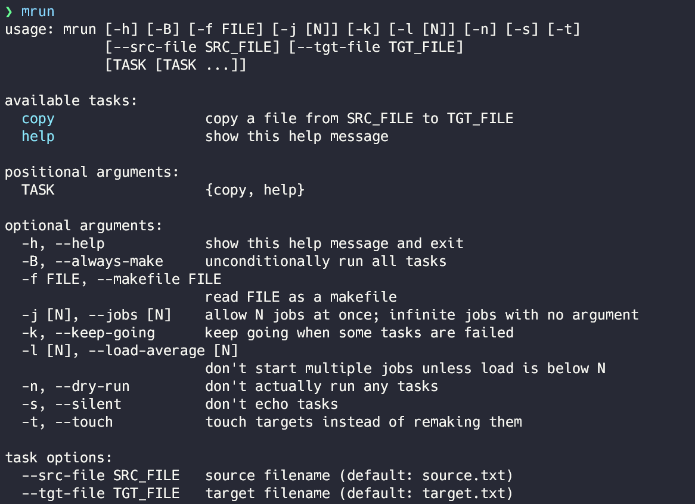

.. image:: https://user-images.githubusercontent.com/12455831/122683398-cd0bbf00-d239-11eb-95cc-39a1bf911224.png
   :alt: banner

Installation
############
You can install via pip.

::

   pip install git+https://github.com/de9uch1/make-runner

Usage
#####
All you have to do is add a comment starting with :code:`##` to your Makefile.
The comment should be added to the end of line of constant settings and PHONY targets.

.. code-block:: makefile

   SRC_FILE := source.txt ## source filename
   TGT_FILE := target.txt ## target filename

   $(TGT_FILE): $(SRC_FILE)
        cp $(SRC_FILE) $(TGT_FILE)

   .PHONY: copy
   copy: $(TGT_FILE) ## copy a file from SRC_FILE to TGT_FILE

Then, type :code:`mrun` in the same directory as your Makefile.

